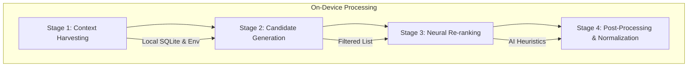

# Technical Documentation: LocalAI Recommendation Engine

## 1. Mathematical Framework

The recommendation engine employs a **Hybrid Scoring Model** that synthesizes traditional rule-based filtering with neural heuristic evaluation. The final score for any given item $i$ is calculated using the following objective function:

$$S(i, u, c) = \omega_{pref} \cdot P(i, u) + \omega_{ctx} \cdot C(i, c) + \omega_{ai} \cdot \Psi(i, u, c)$$

Where:
- $S(i, u, c)$: The final recommendation score for item $i$ for user $u$ in context $c$.
- $P(i, u) \in [0, 1]$: **Preference Match Score**, calculated via Jaccard similarity between user interests and item categories.
- $C(i, c) \in [0, 1]$: **Contextual Relevance**, measuring the alignment between the current user environment (time, location, activity) and the item's metadata.
- $\Psi(i, u, c) \in [0, 1]$: **Neural Re-ranking Score**, a qualitative heuristic generated by the on-device Large Language Model (LLM).
- $\omega_{pref}, \omega_{ctx}, \omega_{ai}$: Weighting coefficients where $\sum \omega = 1$.

In the current implementation (Phase 1), the system prioritizes $\omega_{ai}$ for high-fidelity personalization while maintaining $P(i, u)$ as a safety fallback for "Cold Start" scenarios.

---

## 2. The 4-Stage Scoring Pipeline

The engine processes data through a strictly decoupled pipeline to ensure low latency and maintain the "Privacy-First" architecture.

1.  **Context Harvesting**: Aggregates local user data, including preference vectors from `user_preferences` and interaction history from `user_interactions`.
2.  **Candidate Generation**: A high-speed, rule-based filter that selects a broad set of items matching the user's base categories. This avoids passing the entire database to the LLM.
3.  **Neural Re-ranking**: The local LLM analyzes the candidates against the specific "Generation Context" (e.g., "User is looking for something productive to do on a rainy Tuesday").
4.  **Post-Processing**: Final scores are normalized, and items are deduplicated or filtered based on recent "Dismiss" interactions to ensure diversity.

---

## 3. AI Prompt Strategy & Bias Mitigation

To ensure objective ranking without introducing algorithmic bias, the system utilizes a **Zero-Shot Deterministic Prompting** strategy.

### Prompt Template:
> "You are a neutral local assistant. Evaluate the following items based on: 1. Interest Alignment, 2. Current Context. Return ONLY a valid JSON object. Do not add conversational filler."

### Bias Mitigation Techniques:
- **Role Constraint**: Explicitly defining the AI as a "neutral assistant" prevents it from favoring popular/commercial items unless they align with user data.
- **Structural Enforcement**: By requiring a JSON response with a numerical `score` field, we force the model to quantify its reasoning rather than using persuasive language.
- **Local Inference Isolation**: Since the model (e.g., Mistral or Llama-3) is running locally, it is not influenced by global "trending" data or ad-revenue-driven ranking algorithms prevalent in cloud-based systems.

---

## 4. Privacy-First Architecture

Unlike traditional recommendation engines (Netflix, YouTube), which transmit user preference vectors to central servers, this engine maintains **Data Sovereignty**:
- **Zero Data Leakage**: Sensitive interests never leave the user's device.
- **Local Inference**: The "Neural Re-ranking" happens in-memory on the local CPU/GPU.
- **Auditability**: Users can inspect their local `ai_model_logs` to see exactly how the AI justified a specific recommendation.

---

## 5. Future Scalability: Vector Databases

As the item catalog grows from hundreds to millions, the current SQLite filtering will be augmented with **Vector Similarity Search**:

1.  **Embedding Generation**: Convert items into high-dimensional vectors ($v_i$) using a local embedding model (e.g., `all-MiniLM-L6-v2`).
2.  **Vector Store**: Utilize a local vector database like **ChromaDB** or **Faiss** to perform Approximate Nearest Neighbor (ANN) search.
3.  **Mathematical Evolution**:
    $$P(i, u) = \cos(\theta) = \frac{v_i \cdot v_u}{\|v_i\| \|v_u\|}$$
    This replaces category matching with semantic matching, allowing the system to understand that "Yoga" and "Mindfulness" are related even if the categories don't match exactly.
