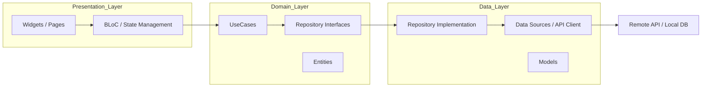
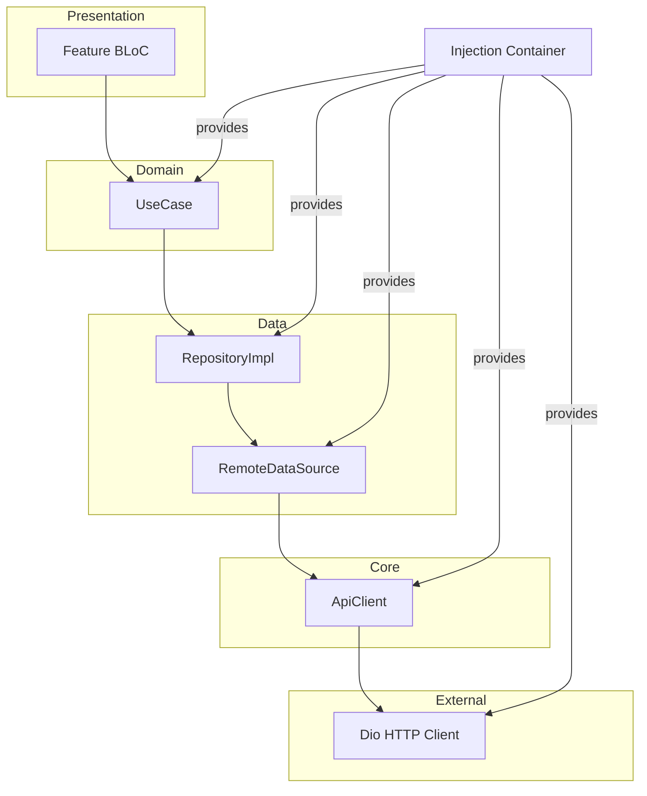

# Frontend Architecture Documentation: LocalAI Mobile

## 1. Architectural Philosophy: Clean Architecture

The LocalAI mobile application is engineered following the principles of **Clean Architecture** (pioneered by Robert C. Martin). This approach emphasizes the **Separation of Concerns (SoC)**, ensuring that the business logic remains decoupled from the UI, external frameworks, and data sources.

### 1.1 Data Flow and Layer Interaction

The application is divided into three primary layers, each with specific responsibilities:

1.  **Presentation Layer**: Responsible for rendering the UI and handling user interactions. It uses the **BLoC (Business Logic Component)** pattern to manage state.
2.  **Domain Layer**: The most stable layer, containing the core business logic. It consists of **Entities** (pure data objects), **UseCases** (specific business rules), and **Repository Interfaces** (defining how data should be fetched without knowing the source).
3.  **Data Layer**: Responsible for data retrieval and persistence. It contains **Repository Implementations**, **Data Sources** (API clients or local databases), and **Models** (data Transfer Objects with JSON serialization).

---

## 2. State Management Strategy: BLoC

The **BLoC (Business Logic Component)** pattern was chosen as the primary state management solution for several reasons:

*   **Predictability**: By using Events to trigger State changes, the flow of data becomes unidirectional and easy to trace.
*   **Decoupling**: BLoCs act as a bridge between the Domain layer (UseCases) and the Presentation layer (Widgets), preventing UI code from containing business logic.
*   **Testability**: Since BLoCs are pure Dart classes that transform streams of events into streams of states, they can be unit-tested without an emulator or UI context.

---

## 3. Dependency Injection (DI)

Dependency Injection is managed globally via the `get_it` service locator. This ensures that every layer has access to its required dependencies without manual instantiation, promoting loose coupling.

### 3.1 Dependency Graph

The `injection_container.dart` file acts as the single point of configuration for all app-wide singletons and factories.

---

## 4. Development Standards

### 4.1 Linting and Code Style
The project adheres to the official `flutter_lints` package. Key rules enforced include:
-   `camel_case_types`: Enforces consistent naming for classes and types.
-   `prefer_const_constructors`: Maximizes performance by encouraging constant widget trees.
-   `always_specify_types`: Encouraged for public APIs to improve readability (optional based on team preference).

### 4.2 Commit Conventions
The repository follows the **Conventional Commits** specification:
-   `feat:` New features (e.g., `feat: implement login screen`)
-   `fix:` Bug fixes (e.g., `fix: resolve overflow in rec card`)
-   `refactor:` Code changes that neither fix bugs nor add features
-   `docs:` Documentation updates

---

## 5. Feature Implementation Guide

To add a new feature (e.g., "Settings"), follow these steps:

1.  **Domain Layer**:
    *   Create an `Entity` (e.g., `SettingsEntity`).
    *   Define a `Repository` interface.
    *   Create `UseCases` (e.g., `GetSettings`, `UpdateSettings`).
2.  **Data Layer**:
    *   Create a `Model` extending the Entity with JSON serialization.
    *   Implement the `DataSource` (API calls).
    *   Implement the `Repository` interface.
3.  **Presentation Layer**:
    *   Define `SettingsEvent` and `SettingsState`.
    *   Implement the `SettingsBloc`.
    *   Build the `SettingsPage` using `BlocBuilder`.
4.  **Dependency Injection**:
    *   Register all new classes in `injection_container.dart`.
5.  **Navigation**:
    *   Add the new route to `app_router.dart`.
